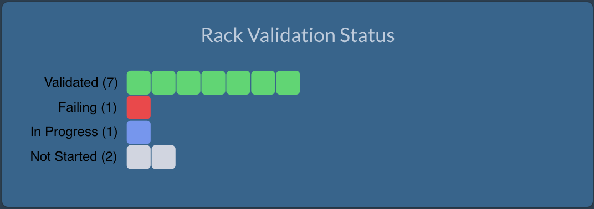
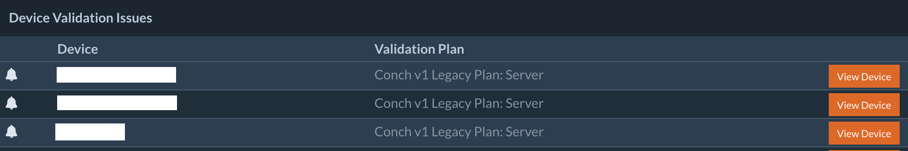
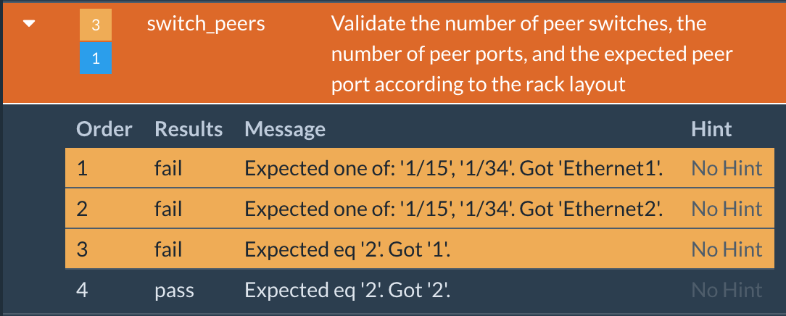
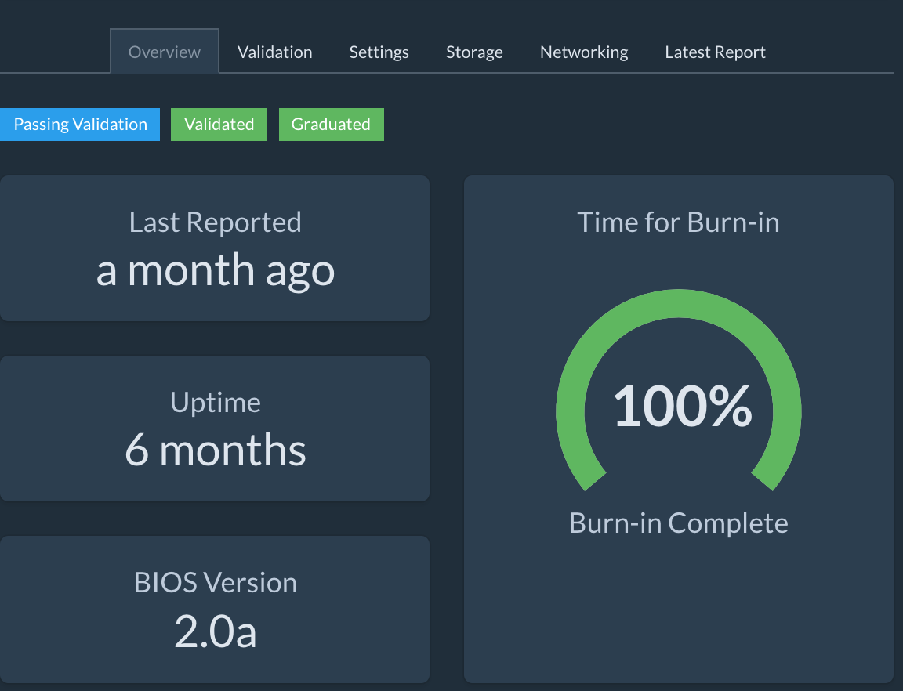

# Status Information

## Status Information

### Status Page: Validation Progress

The Status page contains a progress diagram. Each cell represents a rack.

As systems come online and begin validation, the cells in the bar will fill.

| Color | Description |
|-------|-------------|
| Grey  | Pending     |
| Green | All devices validated |
| Blue  | Devices in progress |
| Red   | One or more devices have failed validation. |

### Status Page: Validation Failures List

The Status Page contains a summary of the devices with validation problems.
Click View Device to open details and review the validation failures.

### Device Details: View Validation Failure

When a device fails validation, the Validation tab in the Device Details view
will provide information on what has failed. In this case, the devices
networking is not cabled correctly.

### Device Details: Validation Complete

When a device has validated completely, the Device View will look something like
this:

## Icons Legend

| Icon | Description |
|------|-------------|
|  | Item requires attention |
|  | If device, it is failing validation. If datacenter or rack listing, a device contained within is failing validation. |
|  | Datacenter, rack, or device is currently being validated. |
|  | No report has been collected from this device yet. |
|  | Device has been validated and has been shut down. |
