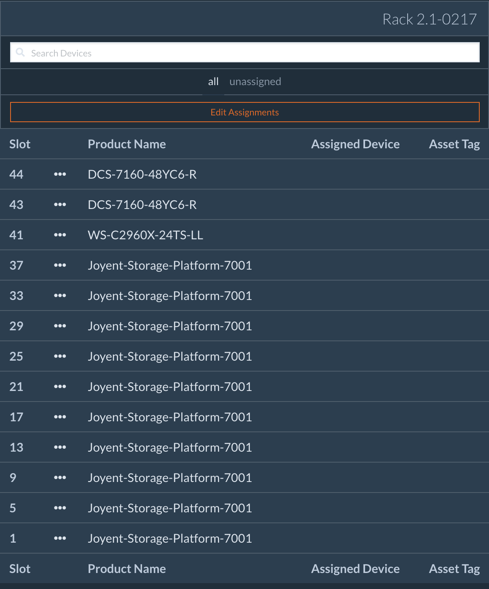
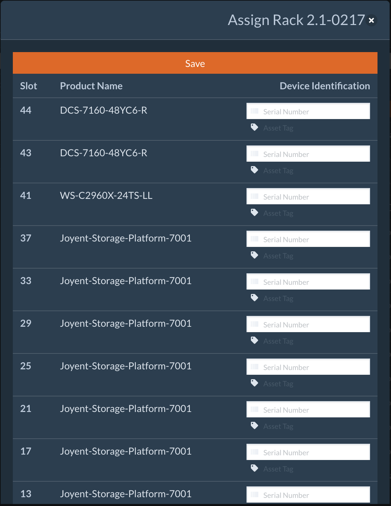

# Usage and Validation Procedures

When it comes time to validate an assembled rack, Joyent Build Operations will
direct integration personnel to attach a DRD to a rack in the manner prescribed
below. At this point, all devices in the rack should be completely powered off.

## Attaching The DRD

A DRD requires 2 ethernet and 1 power connection to a rack:

* ETH0 should be plugged into port 21 on the Cisco management switch
* ETH1 should be plugged into port 23 on the bottom Arista switch

The cable for ETH1/Arista requires the included 1gig copper SFP module.

The AC-DC power adaptor. Ensure that the DRD is powered and the blue lamp on the
rear of the unit is illuminated. The blue lamp is a LED that is visible through
the reset button access port to the upper-right of the DC power connector.

## Powering On The Racks

Before applying power to the rack, all serial numbers need to be entered into
the Rack Layout. The contents of each rack are predefined and do not require
modification.

The only data entry required is entering the serial numbers of the devices in
the rack.

Find the specific rack you are working on in the Browse section of the Conch Web
UI. Click the orange "edit assignments" button.

Enter the serial numbers for the systems in each Rack Unit, and then click Save.

If asset tags are being applied to the system, they should also be entered at
this time.

When all serial numbers are entered into the text boxes associated with their
rack unit, press the Assign Devices button to save the information.

The rack is now ready to be powered on.  When the rack’s PDUs are switched on,
the switches, DRD and server BMCs should power on. From this point, the process
is hands-off.

The DRD is programmed to start the servers after assigning IP addresses to the
server BMCs.

The switches and servers will immediately enter the automated upgrade and
validation process.

## Completing A Rack

When the DRD has finished validating a server and all tests are successfully
passed, the server will go through a period of burn-in lasting several hours. A
timer will display how long a given device has left to burn-in when viewing
Device Details.

Upon completion and if no components fail during the burn-in process, the server
will be automatically powered down. When all servers in a rack have reached this
stage, the rack is considered complete, and the DRD may be removed to the next
rack to be put through the Preflight process at the direction of Joyent Build
Operations.
